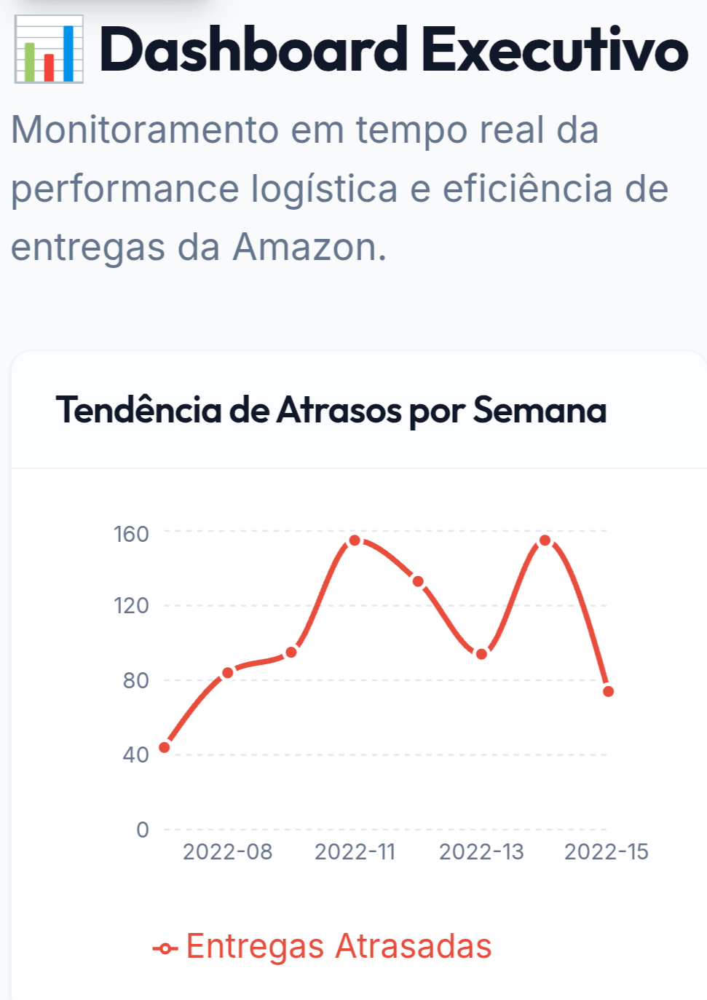

📦 **Amazon Logistics Performance**   

Diagnóstico de Eficiência Operacional e Redução de Atrasos 

 
---

📋 **Visão Geral**

Este repositório apresenta um projeto completo de Análise de Dados aplicada à logística, com foco no diagnóstico das causas de atrasos em entregas da Amazon.

O projeto foi desenvolvido a partir de 43.739 registros operacionais, com o objetivo de identificar gargalos, padrões ocultos e fatores críticos que impactam a experiência do cliente (CX) e o cumprimento de SLAs logísticos.

A entrega final não se limita a análises exploratórias: o projeto gera insights acionáveis, ativos visuais executivos e um relatório em PDF voltado à tomada de decisão estratégica.

---

> 🛠️ **Por que este projeto utiliza Python & GitHub em vez de No-Code (Looker)?**

> Diferente de abordagens tradicionais que utilizam ferramentas de arraste-e-solte como o Looker Studio, este projeto foi desenvolvido integralmente em Python. Esta decisão foi tomada para garantir:

> 1• Escalabilidade e Automação: Ao contrário de dashboards manuais, o uso de scripts (scripts/preparar_dados.py) permite que milhares de novos registros sejam processados e visualizados instantaneamente com um único comando, eliminando o erro humano no tratamento de dados.

> 2•  Reprodutibilidade Técnica: Através do controle de versão no GitHub, cada decisão analítica é auditável. Isso garante que qualquer outro Cientista de Dados possa replicar exatamente os mesmos resultados, algo fundamental em ambientes corporativos de alta governança.
 
>  3•  Engenharia de Analytics: O uso de bibliotecas como Pandas e Seaborn permitiu uma normalização estatística mais rigorosa (como visto na análise de veículos e clima), entregando insights que ferramentas de BI convencionais muitas vezes simplificam demais.
 
> Nota: Este repositório não é apenas uma visualização de dados, mas uma solução de engenharia de dados ponta a ponta.

---

🎯 **Objetivo do Projeto**

Transformar dados operacionais brutos em informação estratégica para tomada de decisão.

**O projeto responde, entre outras, às seguintes perguntas de negócio:**

• Onde estão concentrados os maiores atrasos logísticos?

• Quais fatores operacionais mais impactam o tempo de entrega?

• Como clima, tráfego e tipo de veículo influenciam a eficiência?

• Existem perfis de entregadores ou contextos operacionais mais críticos?

• Que ações práticas podem reduzir atrasos e melhorar o SLA?

---

🛠️ **Decisões Técnicas e Arquiteturais**

Este projeto foi estruturado com foco em clareza, auditabilidade e reprodutibilidade, seguindo boas práticas profissionais de análise de dados.

**Principais decisões:**

Python como linguagem principal
Escolhido pela maturidade do ecossistema de dados e ampla adoção no mercado.

**Arquitetura Modular**

**Separação clara entre:**

• automação de dados (scripts/)

• análise exploratória e diagnóstica (notebooks/)

• ativos executivos e relatórios (reports/)

• documentação técnica (docs/)

**Análise Diagnóstica antes de Modelos Preditivos**

A priorização foi compreender por que os atrasos acontecem antes de propor soluções de Machine Learning, garantindo confiança e transparência para stakeholders.

---

🧰 **Tecnologias Utilizadas**

• Python 3.8+

• Pandas – Manipulação e limpeza de dados

• NumPy – Operações numéricas

• Matplotlib & Seaborn – Visualização de dados

• Jupyter Notebook – Análise exploratória e narrativa analítica

• ReportLab – Geração de relatórios executivos em PDF

---

📂 **Estrutura do Repositório**

---

🗂️ **Detalhamento das Pastas e Arquivos**

📁 **data/raw/**

Dados brutos originais, mantidos imutáveis para garantir rastreabilidade.

📁 **data/processed/**

**amazon_delivery_tratado.csv:** Dataset limpo, tipado e pronto para análise.

📁 **scripts/**

**preparar_dados.py:**
Script de limpeza, padronização, engenharia de atributos e persistência do dataset tratado.
Permite reprocessar os dados sem dependência de notebooks.

📁 **notebooks/**

**Pipeline analítico estruturado:**

**00_preparacao_dados.ipynb** – Preparação inicial e validação dos dados

**01_exploracao_dados.ipynb** – Análise exploratória e qualidade dos dados

**02_analise_atrasos_tempo.ipynb** – Análise temporal e sazonalidade

**03_analise_segmentos.ipynb** – Segmentação por clima, tráfego, veículo e área

**04_insights_negocio.ipynb** – Consolidação de insights estratégicos

📁 **reports/**

**relatorio_executivo.pdf:** Documento final para diretoria

Scripts de geração automática de gráficos e relatórios

**graficos/:** Ativos visuais utilizados em apresentações executivas

**reports/graficos/dashboard_executivo.png:** Uma visão unificada (One-Page) contendo os 4 KPIs principais da operação para apresentações executivas rápidas.

📁 **docs/**

**Documentação técnica e de negócio:**

• Definição do problema

• Premissas analíticas

• Dicionário de dados

• Conclusões técnicas

• Recomendações executivas

---

💡 **Principais Insights (Diagnóstico Analítico)**

**Alta variabilidade operacional:**

• Tempo médio de entrega ≈ 125 min, com desvio padrão elevado (≈ 52 min), indicando baixa previsibilidade.

**Clima como multiplicador de risco:**

• Neblina e tempestades não apenas agravam atrasos — amplificam falhas operacionais existentes.

**Ineficiência por tipo de veículo:**

• Motocicletas apresentam desempenho inferior em áreas Semi-Urban, onde o volume de atrasos supera entregas no prazo.

**Perfil do entregador e tráfego:**

• Existe correlação entre baixas avaliações e atrasos em rotas com tráfego intenso (Jam).

​

---

🚀 **Como Executar o Projeto**

• Pré-requisitos

• Python 3.8 ou superior

• 4 GB de RAM

• Git

**Passo a passo**

• git clone https://github.com/Santosdevbjj/analiseDadosNaPratica.git

• cd analiseDadosNaPratica

• pip install -r requirements.txt

**1. Processar os dados:**

• python scripts/preparar_dados.py

**2. Executar os notebooks (opcional, para análise detalhada)**

**3. Gerar gráficos e relatório:**

• python reports/gerar_relatorio_grafico.py

• python reports/gerar_relatorio_executivo.py

---

🧠 **Aprendizados e Reflexões**

A compreensão profunda do problema é pré-requisito para qualquer solução preditiva.

Separar automação, análise e comunicação executiva aumenta a qualidade e a escalabilidade do projeto.

Documentação clara é tão importante quanto código bem escrito.

O que faria diferente hoje:
Incluir dados externos (clima e tráfego em tempo real) para enriquecer a análise.

---

🔮 **Próximos Passos**

Implementar modelo de Machine Learning para previsão de atrasos

Integração com APIs de tráfego e clima

Criação de dashboard interativo (BI)

---

👤 **Autor**

Sérgio Santos

---

**Contato:**

---

